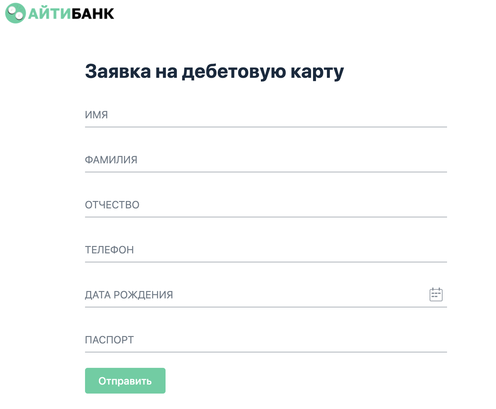
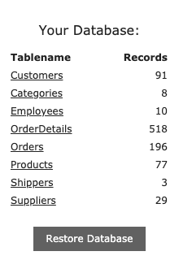
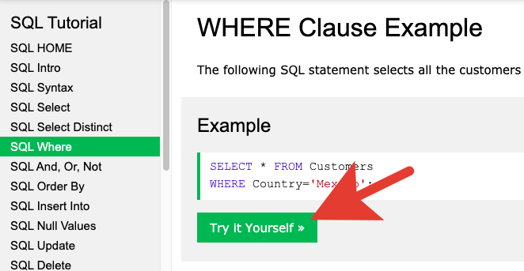
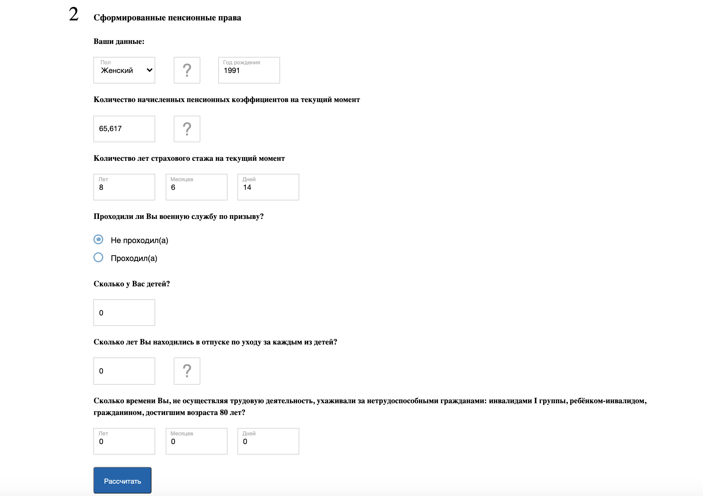
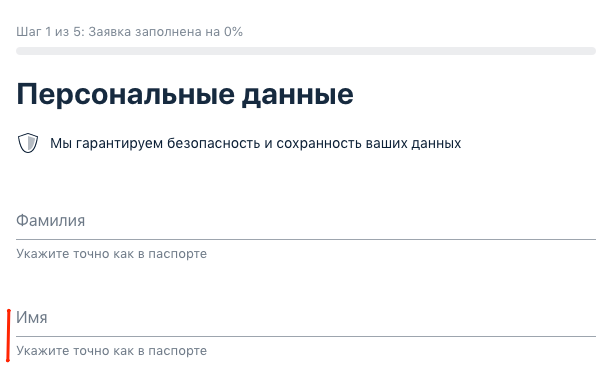

<b>Домашнее задание к занятию «Введение в тестирование ПО. Методы и виды тестирования»</b>

## Задание

Определите подходящие виды и уровни тестирования по описанию ситуаций, в которых работает тестировщик. Возможно, надо применить несколько.

Определяя необходимый вид и уровень тестирования по описанию ситуации, вы сможете подобрать наиболее эффективный способ тестирования сайта/программы.

**Список ситуаций:**

1. Наша команда разработки делает новый сайт, на котором мы сможем смотреть фильмы. Но пока дизайнеры не решили, как будет выглядеть сам сайт, и разработчик сделал только видеоплеер, который мы потом будем использовать. Какой вид или уровень тестирования мы будем применять, если хотим протестировать отдельно этот просмотрщик?

2. Команда разработки систем оплаты сервиса, в котором мы работаем, вместе с новым провайдером интернета сделала новую фишку — при покупке месяца интернета пользователь получает полгода подписки в нашем сервисе в подарок. Наша задача — применить подходящий вид или уровень тестирования для этой ситуации.

3. Наш банк решил сделать приложение для детей, которые учатся пользоваться банковскими картами. Мы целый год его создавали, старались, и вот, наконец, сборка готова, интеграционные тесты пройдены. Всё, казалось бы, работает, и мы почти готовы к настоящему первому релизу в прод. Но перед этим осталось провести самую большую серьёзную проверку. Что же мы применим?

4. Наша компания делает расширение для браузера, которое помогает переводить слова на странице. Но некоторые пользователи почему-то жалуются, что при обновлении версии расширения оно перестаёт переводить. Что же применить?

5. Дизайнеры решили, что наш дизайн управления банковскими переводами устарел, прошло несколько месяцев, и мы зарелизили новый. Но после этого в техническую поддержку начали писать разозлённые пользователи: говорят, что невозможно найти кнопку создания нового перевода, а если и получается её найти, ткнуть на неё невозможно. Но как так, ведь всё было по техническому заданию! Придётся протестировать сервис ещё раз с этим видом тестирования, чтобы понять, почему пользователям неудобно.

6. Мы узнали, что через неделю отдел маркетинга будет делать обширную пиар-кампанию сервиса, который мы тестируем. Наш руководитель сказал, что нужно провести тестирование, показывающее, что наш сайт справится с нагрузкой, которая, предположительно, будет больше нашей обычной в 10 раз. Какой же вид тестирования мы будем проводить?

7. Представим, что мы делаем новостной сайт и зарабатываем на рекламе. Но наши аналитики говорят, что не все пользователи её видят. После проверки мы поняли, что в некоторых браузерах встроено отключение рекламы, но мы не знаем точно, в каких и как она работает так, что не видно наши баннеры. Какое тестирование мы проведём, чтобы понять, где именно не работает функционал?

8. Разработчику поступила задача добавить события аналитики к основным возможностям программы. Перед тем как отдать программу на проверку тестировщику, после изменений разработчик проверяет весь основной функционал на работоспособность. Какой вид тестирования выполняет разработчик?

9. Представим, что мы выпускаем наш сайт с новыми функциями. Он уже протестирован, все новинки работают, но перед тем как выпускать его на всех пользователей, нам нужно проверить, не сломался ли старый функционал — вдруг новые изменения его затронули.

10. Мы работаем в компании, которая делает мобильное приложение. Поздний вечер, все разошлись. Разработчик перед уходом прислал нам на тест сборку с новым функционалом, который он только что сделал. Нам хочется понять, готова ли сборка к полноценному тестированию сегодня. Мы устанавливаем её на телефон, приложение запускается, но нужных нам новых функций почему-то нет. Что ж, сегодня мы уже не сможем протестировать его задачу. Какое тестирование помогло бы нам понять, что и нам уже пора домой?

11. Разработчик добавил новые возможности на сервере, и теперь сервер умеет отвечать на три новых запроса к нему. Чтобы понять, надо ли приступать к полной проверке с негативными, позитивными и прочими сценариями, мы проверили, что сервер действительно отвечает на эти три запроса, если всё сделать как в техническом задании. Какое тестирование мы провели?

## Дополнительная задача более сложного уровня

Есть реальная ситуация из опыта лектора, на основе которой надо сделать выводы на 2–3 предложения. Идеального правильного ответа нет, важно, чтобы вы задумались, как вообще можно применять материал, пройденный на первом занятии.

Мы работаем в компании, которая делает сервис для чтения книг в приложении. Мы можем добавлять книги в свою библиотеку, читать, слушать несколько книг по очереди и так далее — стандартный набор. Но к нам стали поступать жалобы на то, что пользователь не может выйти из текста книги назад, на её описание. Мы удивились, провели проверки, посмотрели на разных устройствах, но у нас всё работает.

Но, увидев эти отзывы в AppStore и GooglePlay, мы поняли, что, возможно, проблема в чём-то ещё. В чём же?

Отзывы из сторов:

*Вопрос к функционалу приложения*

*К подписке вопросов нет, интересующие книги вроде бы есть, однако есть одно но — функционал приложения. Дорогие разработчики, как мне закрыть книгу, чтобы, например, посмотреть что-то другое? Справляюсь следующим образом: удаляю приложение и устанавливаю его заново.*

*Премиум подписка не стоит своей цены!*

*Ужасное приложение! Находясь в книге, нереально выйти в головное меню и подобрать и читать другие книги или сделать что-то ещё.*

*Баг*

*Очень интересная проблема возникла: после открытия книги нет возможности из неё выйти, даже когда перезагружаю приложение, всегда открывается книга, которую я не хочу читать, выйти из чтения никак не могу.*

*Сложности с выходом из книги даже перезапуск приложения не помогает.*

Какие методики из пройденного материала стоило бы использовать более продуктивно, чтобы так не подвести своих пользователей? Опишите эти виды и поясните, почему вы выбрали именно их. Если есть какие-то идеи, помимо описанных в лекции, расскажите и их тоже.

[Моё решение к занятию «Введение в тестирование ПО. Методы и виды тестирования»](https://docs.google.com/document/d/1jnClyNHBSsQ7azZBPvm6ZcX2qEjZdlGxlIXt8Ef80IQ/edit)

<b>Домашнее задание к занятию «Основы клиент-серверного взаимодействия»</b>

## Задание 1

Один из распространённых кейсов для тестирования — тестирование веб-формы для регистрации или отправки данных. Подобные формы есть практически на любом сайте и веб-сервисе.

Вы работаете с анкетой на получение банковской карты, которая включает шесть полей: имя, фамилию, отчество, телефон, дату рождения, серию и номер паспорта.

На первый взгляд, форма выглядит работоспособной. Вам нужно проверить, доходят ли данные клиента до сервера. Если возникает ошибка, то определить, в какой момент она происходит, и передать информацию разработчику.

**Что нужно сделать:**

1. Откройте веб-страницу с анкетой.
2. Заполните анкету.
3. Откройте консоль и определите, в какой момент возникает ошибка.
4. Опишите статусы, которые удалось получить: код ответа, что видит пользователь, что мы видим в консоли, какую информацию мы передадим программистам и почему её и прочее.
   
**Подсказка:**

в поля ввода (ФИО) можно внести:

* редирект,
* потерян,
* плохой,
* неавторизованный,
* чайник,
* ошибка.
* 
И получить соответствующий статус.

## Задание 2

В ходе юзабилити-тестирования выяснилось, что цвет не очень нравится пользователям и они хотят что-то поспокойнее. Наш дизайнер в отпуске, а программисты хотят начать работу над этим прямо сейчас. Вы решили помочь разработчикам в этом.

Откройте [тестовую веб-страницу](http://zayavka-na-kartu-2.sdew.ru/) с формой:

1. Найдите на странице кнопку «отправить» и измените её цвет и цвет текста на ней на синий.
2. Найдите на странице .png логотип банка и смените его на новый логотип, который лежит по данной [ссылке](https://netology.ru/dist/public/images/netology_b83461.png).
3. Воспроизведите на странице ошибку при заполнении формы и замените цвет текста ошибки на серый. Результат — скриншот с исходной и получившейся страницей.

## Задание 3

Это дополнительное задание по SQL. 

### 3.1. Вывести все данные из одной любой таблицы

1. Перейдите по [ссылке](https://www.w3schools.com/sql/trysql.asp?filename=trysql_select_all).

2. Обратите внимание на правую сторону сайта, на список «Your Database:». Это список с таблицами, и вам необходимо выбрать одну из них, например, «Categories» или «Employees».

3. В поле «SQL Statement:» введите запрос, с помощью команды «SELECT * FROM (название таблицы)» , которая сможет вывести все данные из выбранной вами таблицы, и далее нажмите зелёную кнопку «Run SQL».

4. Cделайте скриншоты результатов поля «Result:» по каждой задаче и прикрепите эти скриншоты к выполненной работе.

### 3.2. Вывести одну строку из выбранной вами таблицы

Выберите одну из строк таблицы из задачи 1 и создайте запрос с помощью команды «SELECT * FROM (название таблицы) WHERE (название столбца) = (значение); », которая сможет вывести выбранную вами строку, затем нажмите зелёную кнопку «Run SQL».

Используйте [ссылку](https://www.w3schools.com/sql/), чтобы посмотреть все типы запросов.

Чтобы попробовать решить задачу относительно выбранного вами запроса, выберите один из пунктов, например, «SQL Where», и прокрутив ниже, нажмите на зелёную кнопку «Try it Yourself»:

### 3.3. Обновить выведенную строку

Теперь необходимо создать запрос, который обновит любые данные в этой строке с помощью команды update.

### 3.4. Удалить обновлённую строку

И наконец, нам необходимо удалить обновлённую строку с помощью команды delete.

Прикрепите скриншоты результатов поля «Result:» по каждой задаче в личном кабинете.

[Моё решение к занятию «Основы клиент-серверного взаимодействия». Задание 1](https://docs.google.com/document/d/1Q5V2uzbIU-9AVEVG1u1Cw_lLaRkcLc1LQEoBXt4oYk4/edit)

[Моё решение к занятию «Основы клиент-серверного взаимодействия». Задание 2](https://docs.google.com/document/d/1pAq3ZnYxNB7lDtaPrUi7wy9gpDyJ3a7Joimm1aHQVVI/edit)

[Моё решение к занятию «Основы клиент-серверного взаимодействия». Задание 3](https://docs.google.com/document/d/1jHeIEIx5sTR4JZZ2j2bxUrmfVsqi3dq9QxFfg4qlfQI/edit?pli=1#heading=h.320k15dybn2u)

<b>Домашнее задание к занятию «Тестирование ПО. Тест-дизайн»</b>

## Задание 1
Рассмотрим кейсы. Какие техники тест-дизайна, изученные на уроке, вы бы применили к каждому из кейсов и что именно стали бы проверять? Объясните почему.

### Кейс 1

Допустим, вы получили задание протестировать новый сервис [Рассылок нетологии](https://l.netology.ru/email#rec37570033). Делали его срочно, так что вы его видите в первый раз, и к тому же на него почти нет документации. Какие техники вы примените и что именно из функционала лендинга будете проверять с их помощью?

### Кейс 2

Вам пришло задание на тестирование нового калькулятора подсчёта пенсии. Так как это важная функция, у нас есть всё нужное для тестирования: тестовые данные, информация о требованиях и тестовая среда, где мы можем всё проверить до запуска продукта. Ваша задача — проверить весь функционал именно калькулятора. С применением каких техник вы стали бы это делать?

### Кейс 3

Представим, что вы уже несколько лет тестируете приложение Bookmate для iOS, теперь вам пришла задача, в которой написано, что разработчики бэкенда переделали систему хранения данных о зарегистрированных пользователях. Им важно знать, что ничего не сломалось на фронтенде приложения. Что и по каким методикам вы будете проверять при условии, что у нас сжатые сроки на тестирование?

Результат задания:

* номер кейса;
* название техники, которую вы выбрали;
* пояснение, почему выбрали именно её.

Дополнительная информация: при желании вы можете упомянуть и виды тестирования, которые будут уместны, но для зачёта это не обязательно. Также вы можете в ответе дать несколько вариантов техник, если считаете, что это будет уместно.

## Задание 2
Представим, что мы тестируем форму получения данных от пользователей. Нам нужно применить знания, полученные на лекции, для проверки ввода информации в поле «Имя».

Что нам известно по спецификации: пользователь должен ввести данные на русском языке, чтобы оформить заявку. Максимальная длина поля — 30 символов, минимальная — 1.

Наша задача — проверить максимальное количество как валидных, так и невалидных для системы вариантов ввода данных. Совет: задумайтесь над проверкой не только позитивных вариантов, но и негативных, не описанных в спецификации, так как наша задача — не только проверить соответствие спецификации, но и изучить ситуации, не описанные в ней.

Для получения зачёта нужно как минимум 12 вариантов ввода данных в поле имени.

Результат задания — список вариантов ввода имени + пояснение сути этой проверки.

[Моё решение к занятию «Тестирование ПО. Тест-дизайн»](https://docs.google.com/document/d/1ErJNCMBlF_AkIW_Icft_ljDNAdcsrkIvf43JdGbDseU/edit#heading=h.i8v9s17lmp2f)

<b>Домашнее задание к занятию «Артефакты тестирования. Тестовая документация»</b>

Чтобы убедиться в том, что вы поняли этот и предыдущие материалы, вам нужно подготовить набор тест-кейсов для проверки страницы с формой заявки на оформление банковской карты. Ваша задача — применить изученные техники и методики для проверки функционала страницы сайта.

Ожидаемым результатом будет существующее поведение, в случае, если оно не противоречит логике и здравому смыслу, например, отсутствующие ограничения в полях ввода. Но если вы видите баг, то в ожидаемом поведении вы должны написать то, которое, на ваш взгляд, было бы верным.

Схожие проверки можно объединять: например, разные виды позитивных заполнений поля можно объединить в один кейс, перечислив их в тест-кейсе.

Обратите внимание на то, что это задание направлено на несколько итераций его переработки с преподавателем после сдачи. Сделано это для того, чтобы ваши знания тест-дизайна успешно закрепились на практике и их можно было эффективно применить в дальнейшем обучении. У вас может быть не одна доработка, и это не страшно. Важнее всего, чтобы вы разобрались в непростой теме, а не сдали с первого раза.

Помните, что в этом случае задача — это не написать минимальное количество проверок, а написать тест-кейсы, которые покроют все нужные проверки, и ваша цель — определить, что это за проверки.

[Ссылка на анкету](http://zayavka-na-kartu-1.sdew.ru/)

Задача: вам нужно подготовить тестовые сценарии для максимально полной проверки фронтенда.

* При написании тестовых сценариев нужно использовать практики тест-дизайна и методики тестирования.
* Мы ожидаем от вас более 10 полных тестовых сценариев на функционал, которые будут содержать в себе как позитивные, так и негативные проверки всех полей и возможностей анкеты, с применением техник тест-дизайна, изученных ранее, таких как, например, граничные значения.
* Ваша задача — не написать минимум тестов, а написать тесты с максимальным покрытием.
* Правильное оформление — это тоже часть задания. Убедитесь, что при работе с тест-кейсами виден весь текст и форматирование сделано верно.
* Помимо этого, важно применять правильную терминологию: например, в названии не должно быть слова «Тест», а в результатах не стоит писать «Всё нормально» или «Результат корректный».

[Моё решение к занятию «Артефакты тестирования. Тестовая документация»](https://docs.google.com/spreadsheets/d/1J8MkA9eg050I-JeJFY6g4bERjN1f0W76TzazNmEJU4I/edit#gid=827513718)

<b>Домашнее задание к занятию «Артефакты тестирования. Дефекты»</b>

## Задание

### Часть 1

Перед вами три баг-репорта из опыта лектора. Ваша задача — на основе их шагов, ожидаемого и фактического результата дополнить их названиями, которые будут в полной мере отображать их содержимое и соответствовать стандартам, пройденным на лекции. Обратите внимание, что эти баги не надо пробовать воспроизводить.

#### Баг-репорт 1:

Шаги:

1. Открыть сайт netology.ru.
2. Кликнуть на круг «НЕО для начинающих».
3. Попасть страницу со списком курсов для начинающих. Выбрать в меню справа направление «Программирование».
   
*Фактический результат*

В списке отображаются курсы направления «Маркетинг».

*Ожидаемый результат*

В списке отображаются курсы направления «Программирование».

#### Баг-репорт 2:

Шаги:

1. Зарегистрировать аккаунт на bookmate.com на почту pasha@bm.com.
2. Зарегистрировать аккаунт на bookmate.com почту kirpich@mb.com.
3. Авторизоваться во второй аккаунт по почте kirpich@mb.com.
4. Перейти в настройки и попробовать сменить почту во втором аккаунте на почту первого pasha@bm.com.
   
*Фактический результат*

Крутится бесконечный лоадер на кнопке «Сохранить».

*Ожидаемый результат*

Сообщаем, например, показываем окошко ошибки, пользователю kirpich@bm.com, что аккаунт по почте pasha@bm.com уже зарегистрирован на сайте, поэтому сменить не получится.

#### Баг-репорт 3:

Шаги:

1. Выбрать аудиокнигу в библиотеке.
2. Открыть аудиокнигу.
3. Нажать на воспроизведение.
   
*Фактический результат*

Аудиокнига не воспроизводится и не загружается, появляется «Ошибка воспроизведения».

*Ожидаемый результат*

Аудиокнига начинает загружаться и воспроизводиться.

### Часть 2

Перед вами три баг-репорта из опыта лектора. Ваша задача — проставить для каждого из них соответствующий уровень серьёзности (severity) по стандартам, изученным на лекции. Обратите внимание, что эти баги не надо пробовать воспроизводить.

#### Баг-репорт 1:

Шаги:

1. Заходим на сайт netology.com.
2. Выбираем курс «Основы качественного контента».
3. Листаем до раздела «Наши эксперты знают, в каком контенте есть сила».
   
*Фактический результат*

Фотография в разделе слишком плохого качества и размыта.

*Ожидаемый результат*

Фотография должна быть чёткой, как в оригинале.

#### Баг-репорт 2:

Шаги:

1. Заходим на сайт netology.com.
2. Выбираем курс «Основы разработки звездолётов».
3. Жмём кнопку «Записаться». Попадаем на страницу оплаты.
4. Выбираем тип оплаты «Банковская карта» и жмём «Оплатить».
   
*Фактический результат*

Во всех браузерах всегда открывается страница с текстом «Ошибка 500».

*Ожидаемый результат*

Мы попадаем на страницу оплаты Яндекс.Кассы и имеем возможность успешно оплатить обучение.

#### Баг-репорт 3:

Шаги:

1. Заходим в приложение Google.Maps на iOS.
2. Прокладываем маршрут из точки A, которая отличается от фактического местоположения, в точку Б.
3. Запускаем навигатор.
   
*Фактический результат*

Навигатор прокладывает и отображает маршрут из фактического местоположения, и его невозможно сменить.

*Ожидаемый результат*

Навигатор прокладывает и отображает маршрут из точки А.

### Часть 3

Представьте, что вы работаете в компании [Henderson](https://henderson.ru/). Вам предоставили на тестирование содержание документации к странице карточки товара. Ваша задача — написать минимум 5 дополняющих вопросов, которые помогут вам в будущем более продуктивно протестировать карточку. Вопросы не должны касаться дизайна и вёрстки. Обратите внимание, вопросы надо писать либо в тексте, но другим цветом, либо отдельным списком. Комментарии к тексту файла в самом файле не принимаются. Все комментарии и вопросы вы можете написать в комментарии в личном кабинете при сдаче домашнего задания.

[Ссылка на ТЗ](https://docs.google.com/document/d/1j2OepLp9Si3wtEfkkrFlV8tv84PZGJtB-oJ29UC9aAg/edit?usp=sharing)

[Моё решение к занятию «Артефакты тестирования. Дефекты»](https://docs.google.com/document/d/1nCdmZHeehI9fxDUNh_UUoohZE920oG43MZe4UkgGTf8/edit)

<b>Домашнее задание к занятию «Инструменты тестирования для работы с документацией»</b>

## Задание 1

Продолжаем работать над тестированием [анкеты](http://zayavka-na-kartu-3.sdew.ru/).

### Что нужно сделать

* Протестируйте анкету с использованием тестовых сценариев (тест-кейсов) и техник тест-дизайна, изученных ранее.

* Заведите найденные дефекты. Мы ожидаем от вас не менее, чем 3 функциональных бага, но чем больше вы найдёте, тем лучше.

## Задание 2

Представьте, что вы, как обычно, приходите утром на работу и планируете продолжить тестирование. Однако, открыв под кофе почту и мессенджеры, вы находите письмо от приятеля-разработчика, который работает вместе с вами. «Привет, — пишет он. — Я вчера ушёл в отпуск и прямо перед уходом с работы поймал несколько ошибок — Errors в логе. Все они записались в лог-файл, я скачал его и приложил к письму. Будь другом, заведи, пожалуйста, баг-репорты на эти эрроры, чтобы после возвращения я сразу приступил к работе над ними. Там несколько типов эрроров, не вникай, что с ними да как, просто сгруппируй по типам, почисти дубликаты и оформи со скриншотами и цитатами из лог-файла».

### Что нужно сделать

1. Скачайте [файл](https://teslvova.s3.us-east-2.amazonaws.com/error_file.log).
2. Для лучшей читабельности скопируйте все данные из файла и вставьте их в один из редакторов для работы с кодом.
3. Проанализируйте логи и найдите в них Error-сообщения — скорее всего, там будет несколько одинаковых.
4. Перейдите в Jira.
5. Создайте баг-репорт(ы) на основе вышеуказанных Error-сообщений. Если у вас есть идеи о том, с чем могут быть связаны ошибки — вы можете написать предположения в репортах. Но так как вы не знаете, какие действия вызывают эти события, вы можете не описывать шаги, а поделиться информацией о том, кто вам дал эти логи.

## Задание 3

### Что нужно сделать

Нам надо проверить, не может ли злоумышленник обрушить наш сайт. Что будет, если он обойдёт ограничения по длине поискового запроса и всё же введёт ну очень большую строку? Надо проверить.

1. Зайдите на https://www.mos.ru/search.
2. Запустите любой поисковый запрос и посмотрите, как отреагирует приложение.
3. Исследуйте поле поиска в консоли DevTools.
4. Введите очень длинный текст в строку поиска и посмотрите, не изменится ли реакция приложения при поиске, в том числе и в DevTools.
5. Если вы нашли баг, опишите его в нашей стандартной форме баг-репорта, которую мы использовали ранее. В качестве ожидаемого результата опишите то, как, по-вашему, должна работать эта форма, а в фактическом — расскажите, что видите на самом деле.
6. Если у вас есть идеи или размышления на тему того, баг ли это, как его можно исправить и может ли это вызвать реальные проблемы — напишите, что вы думаете.

[Моё решение к занятию «Инструменты тестирования для работы с документацией». Задание 1](https://docs.google.com/spreadsheets/d/172T7XjketF4ASFvLYHLVQTUHStU-OzR59qb2t-7Su0c/edit#gid=1345076579)

[Моё решение к занятию «Инструменты тестирования для работы с документацией». Задание 2](https://docs.google.com/document/d/1-Qt13Ek2sZFBlBeUJuhT6AGZhqU_NnA6dsoBNZwL0nw/edit)

[Моё решение к занятию «Инструменты тестирования для работы с документацией». Задание 3](https://docs.google.com/spreadsheets/d/1qH8NAKzEkkrtRiMJEA_Uc2DQvE8-_X5LWeYZK9A2djs/edit#gid=0)

<b>Домашнее задание к занятию «Инструменты тестирования. Клиент-сервер»</b>

## Задание 1

Руководитель планирует запустить проект в закрытое бета-тестирование. В нём будут участвовать члены семьи руководителя, включая бабушку. Поэтому нам нужно проверить, выдержит ли наша анкета одновременную работу 15 человек, или кому-то придётся пить кофе, пока остальные тестируют.

[Ссылка на анкету](http://zayavka-na-kartu-3.sdew.ru/)

### Задача

1. При помощи JMeter создайте профиль нагрузки, как было рассмотрено на лекции.
2. Запустите одновременно 15 потоков.
3. Предоставьте отчёт о результатах запуска.

В результате задания вам необходимо прикрепить при отправке три файла-картинки со скриншотами, которые должны отображать:

* request файл
* thread файл
* listener файл
  
## Задание 2

В ходе тестирования проекта разработчики бэкенда обнаружили, что данные, которые приходят на сервер при отправке [формы](http://zayavka-na-kartu-3.sdew.ru/), не такие, какие они должны были получить. Разработчики просят вас протестировать API самостоятельно и задокументировать проблемы для того, чтобы они их смогли исправить.

### Задача

Используя инструмент Postman, попробуйте найти баги. Нашей целью необязательно будет поймать ошибку в ответе от сервера: можно, например, попробовать изменить тело запроса и посмотреть, не будет ли дефектов в содержимом ответа сервера.

[Моё решение к занятию «Инструменты тестирования. Клиент-сервер». Задание 1](https://docs.google.com/document/d/1XK7NwytPTnwZdn9j9maMvb1gC62-hgtZ5x4aeObFB_c/edit?usp=sharing)

[Моё решение к занятию «Инструменты тестирования. Клиент-сервер». Задание 2](https://docs.google.com/spreadsheets/d/144HW4xLB4ZZiAVt3O4Nn4nelQ_Cu1xz1tRVt9ybRRw4/edit?usp=sharing)

<b>Домашнее задание к занятию Жизненный цикл разработки ПО. Гибкие методологии разработки ПО»</b>

Бабушка генерального директора нашего банка не очень хорошо разбирается в интернет-банкинге и постоянно там путается. Поэтому директор решил для всех пенсионных счетов сделать отдельную вкладку, в которой также можно будет переводить деньги между счетами и оплачивать коммунальные услуги. Так как видит бабушка не очень хорошо, то весь шрифт должен быть увеличен, а картинки — стать более чёткими.

Рассмотрите процесс внедрения новых возможностей в готовый продукт.

Какую именно методологию или модель, по вашему мнению, лучше всего выбрать для этой задачи и почему? Опишите, как можно контролировать качество этой фичи на всех этапах разработки и какие действия необходимо совершить тестировщиками до разработки, во время, и уже после. Обратите внимание, что мы ожидаем не только описание общих действий, но и перечисление того, на что стоит обратить внимание, например, если учесть целевую аудиторию нашего дополнения и его особенности.

[Моё решение к занятию Жизненный цикл разработки ПО. Гибкие методологии разработки ПО»](https://docs.google.com/document/d/1wlfw9bbiFAb-BVTnD9YBc1-ZfYoPWJlYUKOeWASZgSM/edit#heading=h.k8m9sb8mx099)
